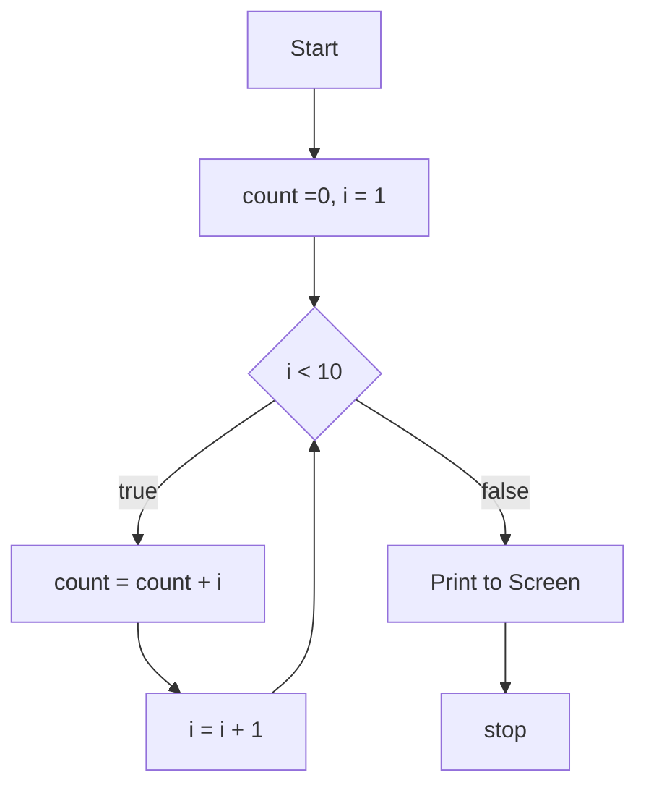

    flowchart TD
        Start[Start] --> Stop[count =0, i = 1]
        Stop -->Loop{i>=10}
        Loop --> | true | Add[count = count +i]
        Add -->Increment [i = i+1]
        Increment --> Loop
        Loop --> | false |  Display [Print to Screen]
        Display --> End[stop]